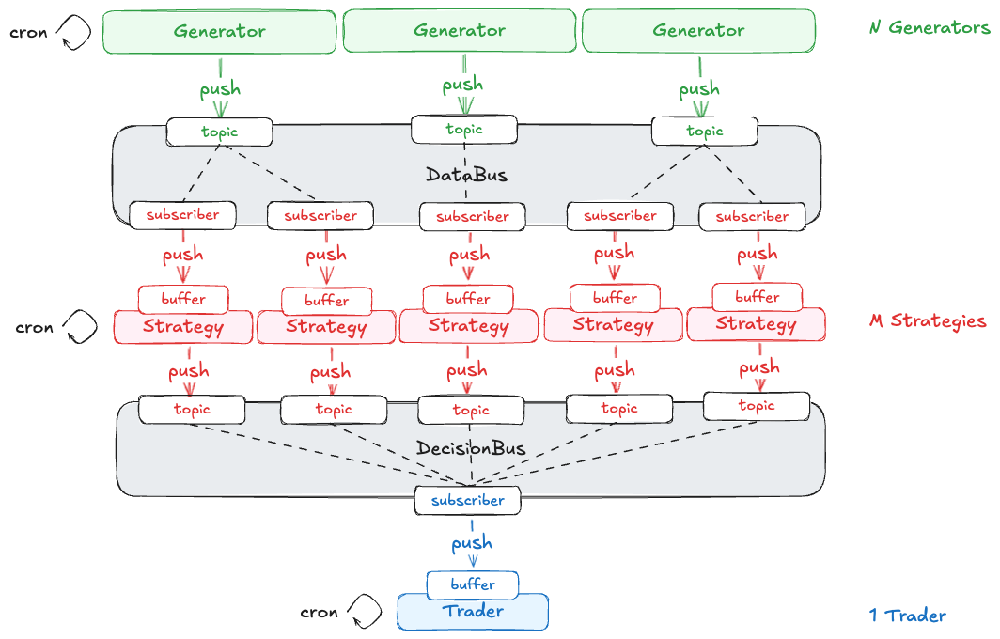

# Event Driven Trading Stack Demo
A lightweight demo of an event-driven trading stack.

## Concept

This repo demonstrates an event-driven trading stack, wherein:
- data collection processes pass data to one-or-more strategies;
- strategies calculate a signal;
- multiple signals are passed to a decision executor process.

We want to be able to run the whole stack with a 5s tick; data should be collected, signals calculated, and decisions executed every 5s.

Let's keep things **super simple** - no docker (docker-compose), no redis, no message queues, no deployment, no cloud. Just pure Python.

We want to be able to add and remove data collection processes and strategies in real time.
We also want a robust pipeline, with safeguards against missing or delayed data.
Our system will need to be stateful, with short-term use data stored in each object.
We want our system to be maximally discoverable and interpretable.
Let's just use pure Python for now.

### Architecture

A data collection process, strategy, and decision executor should respectively be called a `Generator`, `Strategy`, and a `Trader`.
We will also need exchange interfaces between our Generators and Strategies, and our Strategies and our Trader.
Due to the desired many-to-many nature of these exchange interfaces, let's use a pub/sub pattern and define two pub/sub buses: `DataBus` between Generators and Strategies, and `DecisionBus` between Strategies and our Trader.
This gives five objects total: _N_ Generators, _M_ Strategies, a Trader, a DataBus, and a DecisionBus.

These objects need to be stateful: so the system can mutate, with generators and strategies being added and removed; 
and so the objects themselves can access their own history, for example in the calculation of lagged signals.
This suggests the objects will need to live in their own processes, that can be created and destroyed, and communicate over the network.
Objects should therefore be http applications, listening for incoming instructions and routing them accordingly.
The applications will also have state, persisting, in the case of the pub/sub buses, a list of topics and mapped subscribers; or a buffer of previous event data.
This pattern will also be a good basis for future use or deployment of this pipeline, where microservices can be broken out for each generator or service, and an appropriate option for either self-hosted or cloud-based pub/sub service can be chosen.



Strategies and the Trader will need to maintain buffers of incoming events, and will need to actively manage failure modes, for example due to delayed or missing data. 
Each strategy and the trader will need to be programmed to handle such cases, when to fallback to stale data, and when to raise errors and how to handle them.


## Installation

I recommend [uv](https://docs.astral.sh/uv/) for installation.
Easiest way to install `uv` is with curl:

    curl -LsSf https://astral.sh/uv/install.sh | sh

You should also be find with traditional `venv/pip`, just adapt the instructions accordingly:

```bash
uv venv --python 3.13
source .venv/bin/activate
uv pip install -e .
```

## Useage

### CLI

To start, try:

    stack --help

Start `DataBus` and `DecisionBus` pubsubs, and the `Trader` process.

    stack up

Start with a given config yaml:

    stack up --config example.yaml

Choose --foreground / -fg to stream logs to the console:

    stack up -foreground

Add a DataGenerator:

    stack generator add <id>

Drop a DataGenerator:

    stack generator stop <id>

Start a Strategy:

    stack strategy start <id>

Drop a Strategy:

    stack strategy stop <id>

Check the running stack status:

    stack status

Stop the running stack:

    stack stop

### Config Object


## Development

Install with `dev` extra dependencies:

```bash
uv pip install -e ".[dev]"
pre-commit install
```

Run tests:

```bash
pytest
```